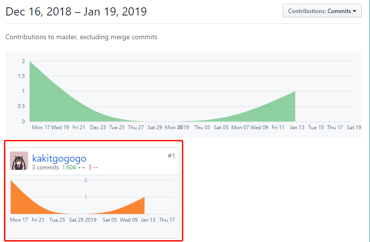
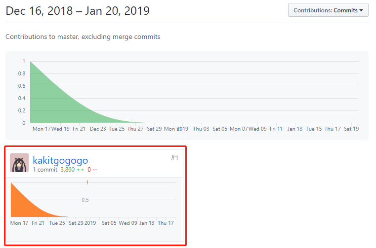
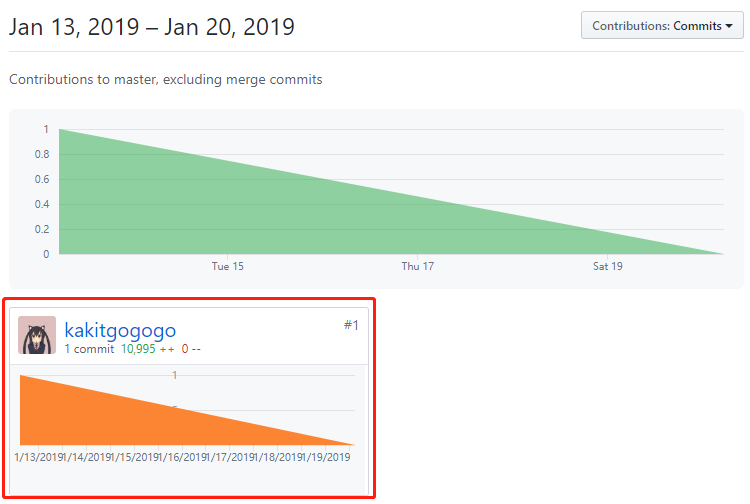
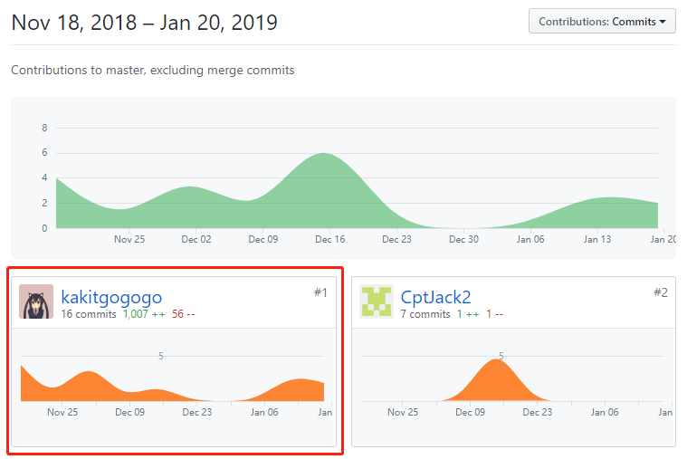

# Final Report

## 自我总结

首先感谢潘老师和衣老师，感谢助教，让我在这个学期学会了如何规范地开发一个应用系统。这次项目中，我负责了前端和后端的开发工作，学习了微信小程序的开发、Django开发框架的使用以及Vue前端框架的使用，这些框架都大大提高了开发的效率。其中Restful API的应用为我在前后端的开发工作带来了很大的方便。除了开发工作，我还参与了部分文档的编写，学会了如何去表达，去展示自己的作品。

## PSP 2.1 统计表

| 工作任务     | 具体任务                                               | Time(%) |
| ------------ | ------------------------------------------------------ | ------- |
| **计划**     | 规划项目中自己要参与和完成的任务                       | **5%**  |
| 规划时间     | 对整个项目以及各个阶段做大致的了解，提前规划           | 5%      |
| **开发**     | 分析设计，编程，后台部署                                         | **95%** |
| 需求分析     | 参与团队分析用户的需求并 | 5%     |
| 生成设计文档 | 参与设计软件的框架 | 5%     |
| 设计复审     | 和队员审核设计文档     | 5%      |
| 技术学习     | 学习常用的部署技术    | 25%     |
| 具体设计     | 设计系统      | 5%      |
| 具体编码     | 前后端开发     | 40%      |
| 具体部署     | 进行云端部署    | 5%     |
| 测试         | 测试部署结果     | 5%     |

## Git统计报告

#### 服务端Git仓库：

#### 客户端Git仓库：

#### 影院管理端Git仓库：

#### Dashboard文档Git仓库：
