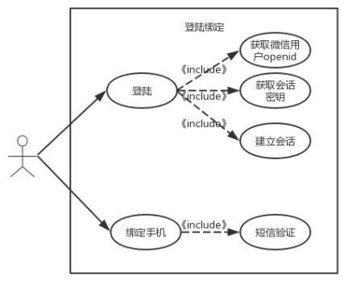

**用例图：**

##### 用例名称：

​	登录及绑定手机

##### 用例范围：

​	微信小程序

##### 用例级别：

​	用户目标

##### 主要参与者：

​	微信用户

##### 涉众及其关注点：

​	微信用户：可以快速登陆，方便快捷完成绑定；

##### 前置条件：

​	微信官方提供的登录能力方便地获取微信提供的用户身份标识，快速建立小程序内的用户体系；

##### 后置条件：

​	用户登录信息准确无误，绑定手机与用户一一对应；

##### 基本流程：

- 用户登陆小程序，提示用户获取信息，点击确定登陆成功；
- 用户购票前需要进行手机绑定，输入手机号后获得短信验证码，输入验证码后如果正确则绑定成功；

##### 特殊需求：

​	界面友好亲和，无须指导即可操作；

##### 发生频率：

​	经常发生；

##### 未决问题：

​	安全性问题；