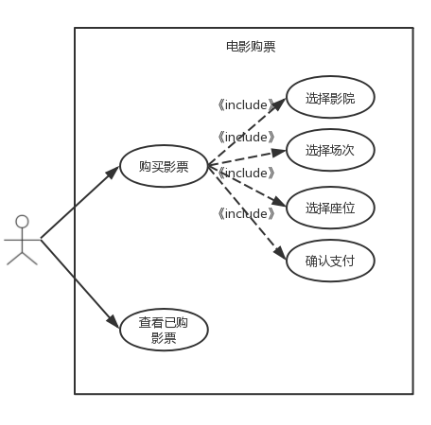

**用例图：**

##### 用例名称：

​	购买影票

##### 用例范围：

​	微信小程序

##### 用例级别：

​	用户目标

##### 主要参与者：

​	微信用户

##### 涉众及其关注点：

​	微信用户：希望能够清晰看到影片信息，方便地查找影片或影院，便利地下单，并且能够收到订单的确认反馈；

##### 前置条件：

​	电影信息，影院信息，座位信息和票价信息是正确的；

##### 后置条件：

​	储存订单信息，准确计算票价，更新影票剩余量和座位信息，记录订单；

##### 基本流程：

- 用户选定电影，获得影片详情；
- 用户根据自身的需求，选定影院，选定场次，选定座位，生成一个新订单；
- 用户确认订单；
- 用户选择支付方式，进行支付；
- 用户得到电子票据；
- 系统记录完整的订单信息，并且更新座位信息；

##### 特殊需求：

​	在支付时对选购座位进行锁定；

##### 发生频率：

​	不断发生；

##### 未决问题：

​	安全性问题；